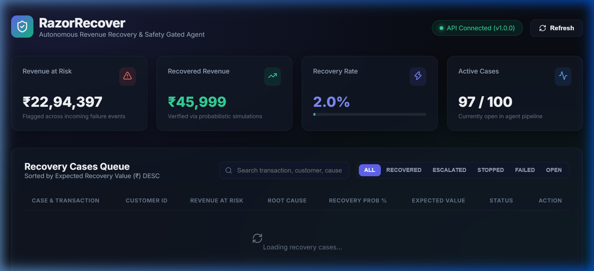

# RazorRecover — Autonomous AI Revenue Recovery Agent

[]()
[]()
[]()
[]()
[]()

> **Razorpay AI Buildathon 2026 — Track 3: AI Revenue Recovery**  
> An end-to-end autonomous agent that detects payment failures, diagnoses root causes, estimates recovery probability, selects policy-compliant interventions using Gemini LLM & a deterministic Priority Matrix Policy Engine, dispatches interventions via simulated APIs, verifies outcomes, and logs audit trails.

---

## Pitch & System Overview

Traditional revenue recovery relies on static retry timers and mass generic email blasts. These cause **high merchant churn**, **customer fatigue**, and **unnecessary interventions on self-healing failures**. 

**RazorRecover** replaces brute-force retries with an **intelligent, policy-gated autonomous loop**:

```
[ Failure Event ] 
       ↓
( Revenue Monitor ) → ( Root Cause Classifier ) → ( Recovery Probability Model )
                                                                 ↓
( Verifier Engine ) ← ( Tool Executor ) ← [ Policy Engine ⨂ LLM Recommender ]
       ↓
( SQLite Audit Trail & React Dashboard UI )
```

### Key Highlights
- **Hybrid Root Cause Classifier**: Diagnoses 6 distinct failure categories (`CARD_EXPIRED`, `INSUFFICIENT_FUNDS`, `NETWORK_TIMEOUT`, `OVERDUE_INVOICE`, `INTENT_ABANDONED`, `AUTHENTICATION_FAILED`) with confidence scores.
- **Explainable Tabular Recovery Model**: Hard-bounded recovery probability scoring (`0.05` to `0.95`) taking into account customer LTV, invoice age, and retry history.
- **Priority Matrix Policy Engine (Rule #1–#13)**: Hard deterministic governance layer gating all AI proposals before dispatch. **Zero policy violations permitted**.
- **Live Gemini LLM Recommender**: Powered by Google Gemini (`gemini-2.5-flash` / `gemini-3.6-flash`) with an offline mock circuit breaker for rate limits.
- **Simulated Tool Executor & Verifier**: Dispatches actions (`payment_api`, `messaging_api`, `escalation_api`) and verifies outcome probabilities per Section 10.1 specs.
- **Single-Page React Dashboard**: Real-time KPI summary, case queue sorted by expected value, side-by-side LLM vs Policy decision modal, and chronological audit timelines.

---

## Quick Navigation Links

- 📋 [Product Requirements Document (PRD.md)](PRD.md)
- 📝 [Development Resolution Record (BUILD_LOG.md)](BUILD_LOG.md)
- 📊 [Un-Tuned Evaluation Report (eval/report.json)](eval/report.json)
- 🌐 [FastAPI Interactive API Reference (/docs)](http://127.0.0.1:8000/docs) *(Requires backend running on port 8000)*

---

## Single-Page Dashboard Interface



*Features live KPI header cards (Revenue at Risk, Recovered Revenue, Recovery Rate %, Active Cases), an interactive case queue table sorted by expected recovery value, and a side-by-side "Why?" decision rationale modal comparing LLM proposals against Policy Engine verdicts with step-by-step audit timelines.*

---

## Evaluation Results Summary (`eval/report.json`)

Evaluated across all 200 held-out evaluation events (`data/events_holdout.csv`) without post-eval tuning:

| Metric | Target | Un-tuned Actual Result |
| :--- | :--- | :--- |
| **Total Held-out Events** | 200 | **200** |
| **Total Revenue at Risk** | N/A | **INR 48,27,162.63** |
| **Potentially Recoverable Revenue** | N/A | **INR 28,36,009.25** |
| **Successfully Recovered Revenue** | N/A | **INR 20,25,090.68** |
| **Recovery Rate (%)** | > 35% | **41.95%** |
| **Unnecessary Interventions (%)** | < 15% | **6.94%** (10 / 144) |
| **Policy Violations** | **0** | **0 (Zero Violations)** |
| **Escalated Cases** | N/A | **21** |
| **Stopped Cases** | N/A | **35** |

---

## Getting Started & Run Instructions

### Prerequisites
- Python 3.10+
- Node.js v18+ & npm
- (Optional) Gemini API Key (`GEMINI_API_KEY`) from [Google AI Studio](https://aistudio.google.com/app/apikey)

---

### 1. Backend Server Setup & Launch

From the repository root:

```bash
# Install Python dependencies
pip install -r requirements.txt

# Launch FastAPI Backend Server
python -m uvicorn backend.api.main:app --port 8000 --reload
```

- Backend REST API: `http://127.0.0.1:8000`
- Interactive OpenAPI Docs: `http://127.0.0.1:8000/docs`

---

### 2. Frontend React Dashboard Setup & Launch

Open a second terminal window:

```bash
# Navigate to dashboard directory
cd frontend/dashboard

# Install npm packages
npm install

# Start Vite dev server
npm run dev -- --port 5173
```

- React Single-Page Dashboard: `http://127.0.0.1:5173`

---

### 3. Running Evaluation Suite

To run the full agent loop against all 200 held-out evaluation events and regenerate `eval/report.json`:

```bash
python eval/run_eval.py
```

---

### 4. Running Live Gemini LLM Trace

To test a sample event with live Gemini API execution:

```powershell
# Set your Gemini API key (starts with AIzaSy... or AQ...)
$env:GEMINI_API_KEY="AIzaSy..."

# Execute live LLM trace script
python run_live_llm_event.py
```

---

### 5. Running Automated Unit Tests

To run the complete workspace test suite across all 13 build phases:

```bash
python -m unittest discover tests
```

---

## Repository Architecture & Structure

```
RazorRecover/
├── backend/
│   ├── api/                 # FastAPI REST application & endpoints
│   │   ├── main.py          # CORS middleware & lifespan init
│   │   └── routes/          # /events, /cases, /metrics routes
│   ├── db/                  # SQLModel database schemas & session setup
│   └── engine/              # Core Autonomous Agent Loop Pipeline
│       ├── revenue_monitor.py # Event ingestion & at-risk detection
│       ├── classifier.py     # Root cause diagnostic engine
│       ├── recovery_model.py # Tabular probability model (bounded [0.05, 0.95])
│       ├── policy_engine.py  # Priority Matrix Rules #1-#13 Gating
│       ├── recommender.py    # Live Gemini LLM Recommender & mock fallback
│       ├── executor.py       # Simulated tool action dispatchers
│       ├── verifier.py       # Outcome verification probabilities (Section 10.1)
│       ├── audit.py          # Centralized SQLite audit logging
│       └── agent_loop.py     # End-to-end agent pipeline orchestrator
├── data/
│   ├── events_dev.csv       # 800 synthetic development events
│   └── events_holdout.csv   # 200 held-out evaluation events
├── eval/
│   ├── run_eval.py          # Held-out evaluation script
│   └── report.json          # Exported evaluation metrics report
├── frontend/
│   └── dashboard/           # Vite + React Single-Page App
│       ├── src/App.jsx      # Dashboard UI, case table, & Why modal
│       └── src/index.css    # Dark mode design system & styling
├── tests/                   # 13 comprehensive unit test suites
├── BUILD_LOG.md             # Incident record & architectural resolutions
├── PRD.md                   # Product Requirements Document
├── TASKS.md                 # Project task checklist
└── README.md                # Project documentation & pitch
```

---

## License

Developed for **Razorpay AI Buildathon 2026**. Licensed under the MIT License.
